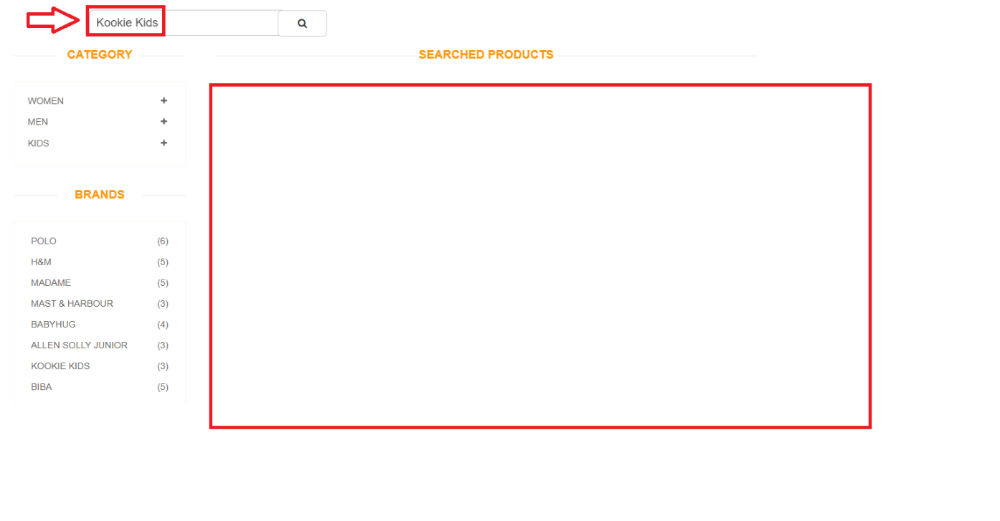
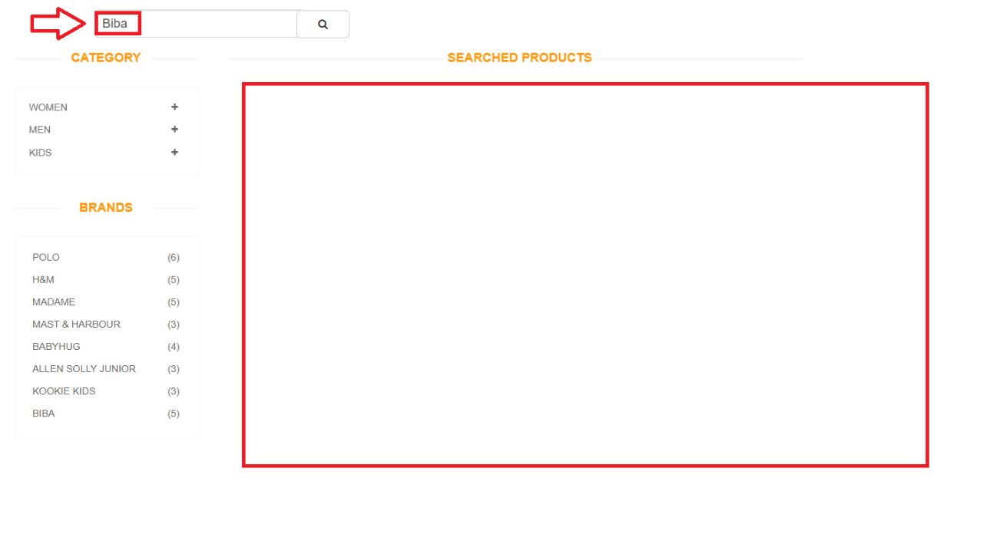
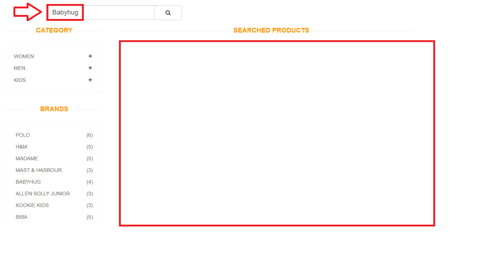

# 🐞 Bug Report

- **Bug ID:** SRCH-002    
- **Tester:** Henrique Koaski  
- **Date:** 2025-06-11  
- **Title:** Search bar does not return products when searching by brand

---

## 📋 Description
The search functionality using the search bar on the products page does not return any results when users search for brand names such as "Babyhug", "Kookie Kids", or "Biba". This issue affects the user experience by preventing users from finding products based on their brand preferences.

---

## ⚠️ Severity & Priority
- Severity: Major 
- Priority: High

---

## ✅ Steps to Reproduce
1. Navigate to the Products page.
2. Type a brand name into the search bar (e.g., "Biba").
3. Click the search button.

---

## 🎯 Expected Results
The system should return and display products that match the searched brand name.

---

## ❌ Current Results
No products are shown. The results section remains empty.

---

## 🔍Evidences 
- 📸 **Image Evidences:**
  

- 🎥 **Video Evidence:** [Click here to watch](https://www.youtube.com/watch?v=ZLC0gtAb9yk)

--- 

## 🧪 Environment:  
- Website: [https://automationexercise.com](https://automationexercise.com)  
- Browser: Chrome - Version 137.0.7151.104 (Official Build) (64-bit)
- Operating System: Windows 11 

