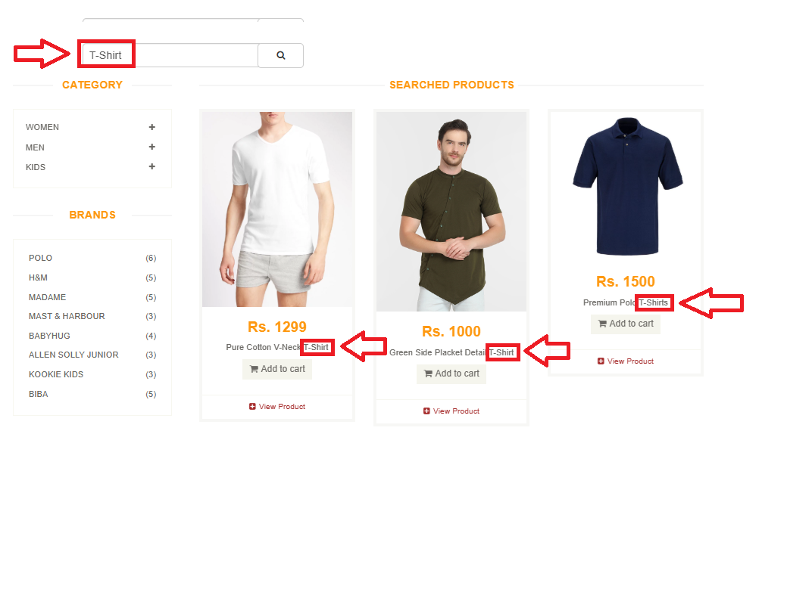
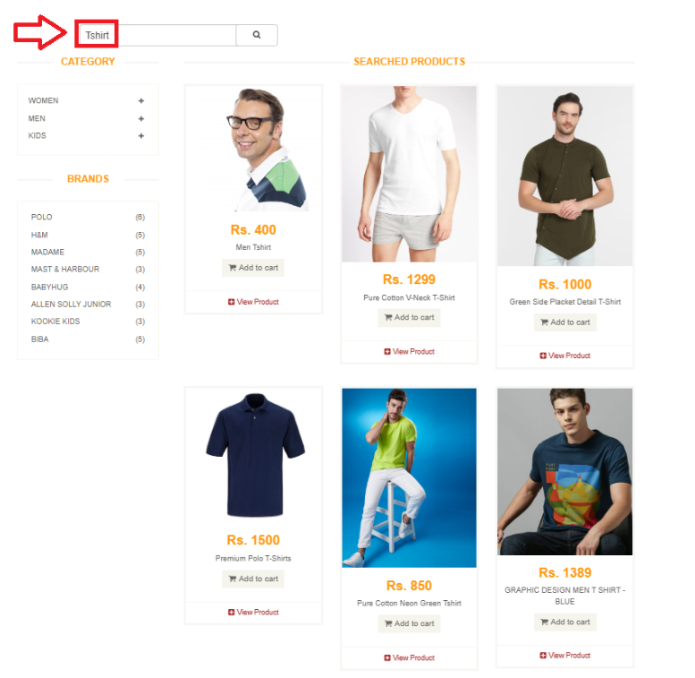

# 🐞 Bug Report

- **Bug ID:** SRCH-001    
- **Tester:** Henrique Koaski
- **Date:** 2025-06-11
- **Title:** Search by category "T-Shirt" fails due to incorrect category name "Tshirts" in the system

---

## 📋 Description
The search by category fails for "T-Shirt" because the category is incorrectly named as "Tshirts" in the system. As a result, the search does not return items by category, only by product titles containing "T-Shirt"

---

## ⚠️ Severity & Priority
- Severity: Major  
- Priority: High

---

## ✅ Steps to Reproduce
1. Access the products page.  
2. Type `T-Shirt` in the search bar.  
3. Click the search button.

---

## 🎯 Expected Results
The system should return **all products related to the "T-Shirt" category**, totaling **6 items**.

---

## ❌ Current Results
The system is **not filtering the products by the "T-Shirt" category**.

The system returns only **3 items**. These items contain "T-Shirt" in the **product title**, but they are not being filtered by category — instead, they are matched based on text found in the titles.

---

## 🔍Evidences 
- 📸 **Image Evidences:**
  

- 🎥 **Video Evidence:** [Click here to watch](https://www.youtube.com/watch?v=PDZRET4i6IE)

--- 

## 🧪 Environment:  
- Website: [https://automationexercise.com](https://automationexercise.com)  
- Browser: Chrome - Version 137.0.7151.104 (Official Build) (64-bit)
- Operating System: Windows 11 

---

## 🧠 Root Cause
The category is incorrectly registered in the system as `Tshirts` (without hyphen), while the search is performed using `T-Shirt`.  
As a result, the system does not match the correct category and only returns results based on title keywords.

---

## 🧩 Suggestion for Improvement
1. **Correct the category name**:  
   Rename the category from `Tshirts` to the correct format `T-Shirt` to ensure consistency with common usage and search expectations.

2. **Implement tolerant search**:  
   The system should support a **search that tolerates minor grammatical or spelling errors**.  
   Examples:  
   - When a user types `tshirt`, `T-shirt`, or `T shirt`, the system should understand the intent is to search for the “T-Shirt” category and return all matching items.  

This enhancement would provide a **more efficient user experience** and reduce frustration caused by failed searches.

